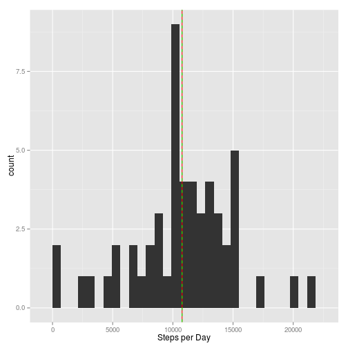
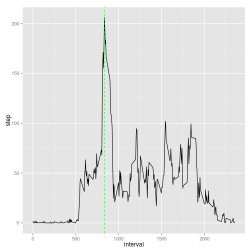
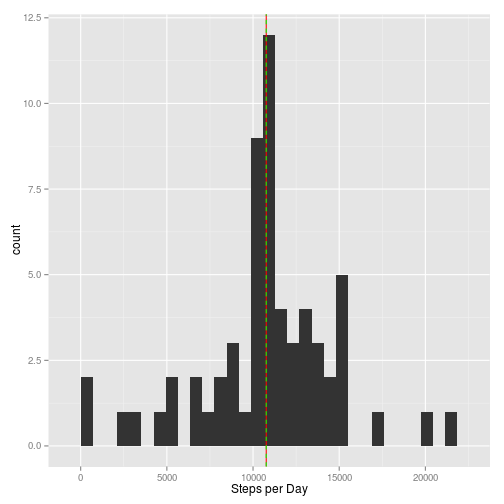
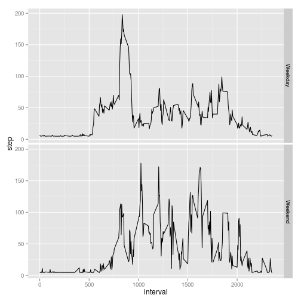

# Reproducible Research: Peer Assessment 1


## Loading and preprocessing the data

```r
library(ggplot2)
df <- read.csv("activity.csv", sep = ",", na.strings = "NA", stringsAsFactors = FALSE, 
    header = TRUE)
df$date <- as.Date(df$date, "%Y-%m-%d")
```


## What is mean total number of steps taken per day?

```r
spd <- tapply(df$steps, df$date, sum)
qplot(spd) + geom_vline(xintercept = mean(spd, na.rm = TRUE), color = "red") + 
    geom_vline(xintercept = median(spd, na.rm = TRUE), color = "green", lty = 2) + 
    xlab("Steps per Day")
```

```
## stat_bin: binwidth defaulted to range/30. Use 'binwidth = x' to adjust this.
```

 


```r
mean(spd, na.rm = TRUE)
```

```
## [1] 10766
```


```r
median(spd, na.rm = TRUE)
```

```
## [1] 10765
```


## What is the average daily activity pattern?

```r
omit <- na.omit(df)
intervals <- tapply(omit$steps, omit$interval, mean)
df2 <- data.frame(step = intervals, interval = as.numeric(rownames(intervals)))
max <- df2[df2$step == max(df2$step), 2]
qplot(interval, step, data = df2, group = 1, geom = "line") + geom_vline(xintercept = df2[df2$step == 
    max(df2$step), 2], color = "green", lty = 2)
```

 


## Imputing missing values

```r
sum(!complete.cases(df))
filled = data.frame(df)
filled$steps[is.na(filled$steps)] <- mean(filled$steps, na.rm = TRUE)
spd <- tapply(filled$steps, filled$date, sum)
qplot(spd) + geom_vline(xintercept = mean(spd, na.rm = TRUE), color = "red") + 
    geom_vline(xintercept = median(spd, na.rm = TRUE), color = "green", lty = 2) + 
    xlab("Steps per Day")
```

```
## stat_bin: binwidth defaulted to range/30. Use 'binwidth = x' to adjust this.
```

 


```r
mean(spd, na.rm = TRUE)
```

```
## [1] 10766
```


```r
median(spd, na.rm = TRUE)
```

```
## [1] 10766
```


## Are there differences in activity patterns between weekdays and weekends?

```r
weekends <- function(d) {
    if (weekdays(d) %in% c("Saturday", "Sunday", "domingo", "sabado")) {
        "weekend"
    } else {
        "weekday"
    }
}
filled$weekday <- sapply(filled$date, weekends)
wkd <- filled[filled$weekday == "weekday", ]
intervals_wkd <- tapply(wkd$steps, wkd$interval, mean)
df3 <- data.frame(step = intervals_wkd, interval = as.numeric(rownames(intervals_wkd)), 
    wkd = "Weekday")
wknd <- filled[filled$weekday == "weekend", ]
intervals_wknd <- tapply(wknd$steps, wknd$interval, mean)
df4 <- data.frame(step = intervals_wknd, interval = as.numeric(rownames(intervals_wknd)), 
    wkd = "Weekend")
wk <- rbind(df3, df4)
qplot(interval, step, data = wk, group = 1, geom = "line", facets = wkd ~ .)
```

 

